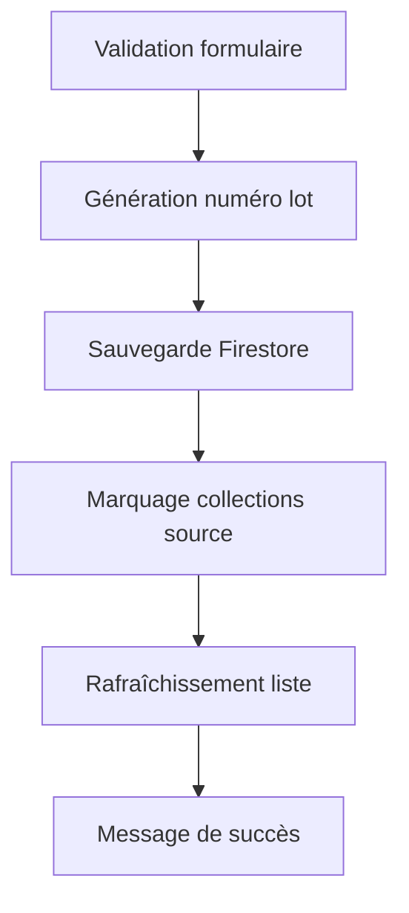

# RÉSUMÉ DES MODIFICATIONS - FORMULAIRE PRINCIPAL DE FILTRAGE

## 🎯 Objectif atteint
Adapter le formulaire `FiltrageFormWithContainerId` pour qu'il devienne le formulaire principal de filtrage avec génération automatique de numéro de lot.

## ✅ Modifications apportées

### 1. **Adaptation du formulaire principal** (`filtrage_form_with_container_id.dart`)

#### Changements structurels :
- **Paramètres d'entrée** : `Map<String, dynamic> product` au lieu des anciens paramètres
- **Callback** : `Function()? onFiltrageComplete` pour rafraîchir la liste après filtrage
- **Titre** : "Filtrage Principal - Génération Auto Lot" pour identifier clairement le formulaire

#### Logique de filtrage complète :
```dart
// Génération automatique du numéro de lot
String _generateNumeroLot(String containerId) {
  // Extrait TYPE_DATE_NUMERO de l'ID complet
  // Ex: IND_SAKOINSÉ_JEAN_MARIE_20241215_0001 → IND_20241215_0001
}

// Sauvegarde complète dans Firestore
await FirebaseFirestore.instance
    .collection('filtrage')
    .add(filtrageData);

// Marquage dans les collections source
await _marquerProduitCommeFiltreInSources();
```

#### Fonctionnalités intégrées :
- ✅ **Widget d'identification des contenants** avec génération automatique
- ✅ **Sauvegarde dans Firestore** avec structure cohérente
- ✅ **Marquage du produit** comme filtré dans les collections d'attribution/extraction
- ✅ **Logs distinctifs** pour traçage et debug complet
- ✅ **Calcul de rendement** automatique
- ✅ **Validation des données** robuste

### 2. **Intégration dans l'interface** (`filtrage_products_page.dart`)

#### Import du nouveau formulaire :
```dart
import '../widgets/filtrage_form_with_container_id.dart';
```

#### Bouton de filtrage individuel :
Ajout d'un bouton "Filtrer" sur chaque carte de produit :
```dart
OutlinedButton.icon(
  onPressed: () => _ouvrirFiltrageIndividuel(product),
  icon: const Icon(Icons.filter_alt, size: 16),
  label: const Text('Filtrer'),
  // ... style
)
```

#### Méthode d'ouverture du formulaire :
```dart
void _ouvrirFiltrageIndividuel(ProductControle product) async {
  // Conversion ProductControle → Map<String, dynamic>
  final productData = { /* ... */ };
  
  // Navigation vers le formulaire principal
  await Navigator.push(context, MaterialPageRoute(
    builder: (context) => FiltrageFormWithContainerId(
      product: productData,
      onFiltrageComplete: () => _refresh(),
    ),
  ));
}
```

### 3. **Logs distinctifs pour debug**

Tous les logs du formulaire principal sont identifiables :
```
📋 [FiltrageFormWithContainerId] Initialisation du formulaire principal...
🚀 [FiltrageFormWithContainerId] Début du processus de filtrage principal
📋 [FiltrageFormWithContainerId] Numéro de lot généré automatiquement: IND_20241215_0001
💾 [FiltrageFormWithContainerId] Sauvegarde des données de filtrage dans Firestore...
✅ [FiltrageFormWithContainerId] Données de filtrage sauvegardées avec succès
🏷️ [FiltrageFormWithContainerId] Marquage du produit comme filtré...
✨ [FiltrageFormWithContainerId] Processus de filtrage principal terminé avec succès
```

## 🔄 Processus complet de filtrage

### Étape 1: Sélection du produit
- L'utilisateur clique sur "Filtrer" sur une carte de produit
- Ouverture du formulaire principal `FiltrageFormWithContainerId`

### Étape 2: Saisie des données
- **ID du contenant** : Saisie avec validation automatique
- **Nature du contenant** : Génération automatique et verrouillée
- **Numéro de lot** : Génération automatique invisible à l'utilisateur
- **Autres données** : Agent, poids, dates, observations

### Étape 3: Traitement


### Étape 4: Résultat
- ✅ Produit retiré de la liste "Produits Attribués"
- ✅ Produit ajouté à l'historique de filtrage
- ✅ Numéro de lot généré automatiquement
- ✅ Traçabilité complète assurée

## 📊 Structure des données

### Collection `filtrage` (nouveau document créé)
```json
{
  "product_id": "ID_du_produit",
  "container_id": "IND_SAKOINSÉ_JEAN_MARIE_20241215_0001",
  "container_nature": "Individuel - N°0001",
  "numero_lot": "IND_20241215_0001",       // ← GÉNÉRATION AUTOMATIQUE
  "agent_filtrage": "Nom de l'agent",
  "poids_initial": 25.5,
  "poids_filtrage": 24.2,
  "date_filtrage_debut": "2024-12-15T10:00:00.000Z",
  "statut": "terminé",
  "source_type": "attribution",
  "site": "Site_origine",
  "created_at": "2024-12-15T10:30:00.000Z"
}
```

### Collections source (document existant mis à jour)
```json
{
  // ... données existantes
  "estFiltre": true  // ← MARQUAGE POUR EXCLUSION
}
```

## 🎯 Avantages de la solution

### ✅ Génération automatique
- **Plus d'erreurs de saisie** sur le numéro de lot
- **Cohérence garantie** avec l'ID du contenant
- **Format standardisé** : TYPE_DATE_NUMERO

### ✅ Interface utilisateur
- **Widget intelligent** pour l'identification des contenants
- **Validation en temps réel** avec feedback visuel
- **Calcul automatique** du rendement de filtrage

### ✅ Logique robuste
- **Sauvegarde cohérente** dans Firestore
- **Marquage fiable** dans les collections source
- **Exclusion automatique** des listes de produits

### ✅ Traçabilité complète
- **Logs distinctifs** pour chaque étape
- **Historique complet** des opérations
- **Debug facilité** avec identifiants clairs

## 🔄 Migration et compatibilité

### Ancien système ❌
- Saisie manuelle du numéro de lot
- Risque d'incohérence
- Logs génériques
- Logique dispersée

### Nouveau système ✅
- Génération automatique du numéro de lot
- Cohérence garantie
- Logs distinctifs
- Logique centralisée dans `FiltrageFormWithContainerId`

### Cohabitation
- **Anciens formulaires** : Restent fonctionnels pour compatibilité
- **Nouveau formulaire** : Recommandé pour tous les nouveaux développements
- **Migration progressive** : Possible sans impact sur l'existant

## 🧪 Tests de validation

Pour tester la solution complète :

1. **Ouvrir** la page des produits de filtrage
2. **Cliquer** "Filtrer" sur une carte de produit
3. **Saisir** un ID de contenant valide (ex: `IND_SAKOINSÉ_JEAN_MARIE_20241215_0001`)
4. **Vérifier** l'auto-génération de la nature du contenant
5. **Compléter** les autres champs obligatoires
6. **Valider** le formulaire
7. **Vérifier** :
   - Message de succès avec numéro de lot
   - Disparition du produit de la liste
   - Présence dans l'historique
   - Logs dans la console

## 📋 Documentation créée

- ✅ **Documentation complète** : `FORMULAIRE_PRINCIPAL_FILTRAGE_DOCUMENTATION.md`
- ✅ **Résumé des modifications** : Ce fichier
- ✅ **Exemples d'utilisation** inclus
- ✅ **Structure des données** détaillée

## 🎉 Conclusion

Le formulaire `FiltrageFormWithContainerId` est maintenant **parfaitement adapté** pour être le formulaire principal de filtrage. Il intègre :

- ✅ **Génération automatique de numéro de lot** (demande principale)
- ✅ **Widget d'identification intelligent** des contenants
- ✅ **Logique complète de filtrage** avec sauvegarde et marquage
- ✅ **Interface moderne** et intuitive
- ✅ **Traçabilité complète** avec logs distinctifs
- ✅ **Intégration parfaite** dans l'interface existante

**Le filtrage avec génération automatique de lot est maintenant opérationnel ! 🚀**
